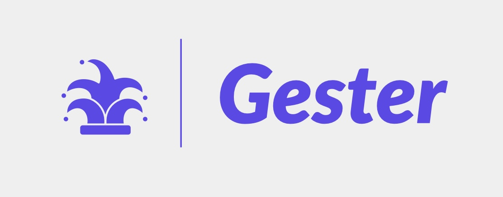

# Gester

Gester is a creative collection of games utilizing an in-house gesture processing library that reads in webcam data to generate an approximation of your hand moving on a desk.

Gester was created as an entry in the 36-hour Boilermake XI Hackathon. You can find the entry [here](https://devpost.com/software/gester-a-gesture-based-arcade-platform).

Contributors:
- Kai Tinkess
- Alex Hunton
- Kian Nowrouzi

## Getting Started

First, run
```bash
git submodule update --init --recursive
```

These instructions will be for MacOS only.

First, install some dependcies and restart your shell:
```bash
brew update
brew install pyenv
brew install pipx
```

Make sure that you follow the [pyenv](https://github.com/pyenv/pyenv) directions to set up your shell.

Now navigate to this directory (`gester/`):
```bash
pyenv install 3.10.5
pyenv local 3.10.5
```

Now get poetry (our dependency manager), create a virtual environment, and install our dependencies:
```
pipx install poetry
poetry shell
poetry install
```

If you are having trouble running `poetry shell` due to python versioning, try `poetry env use $(pyenv which python)`.

Finally, you are able to launch a game as follows:
```
python games/gallery.py
```

## Screenshots

You can find more information and screenshots on the [Devpost](https://devpost.com/software/gester-a-gesture-based-arcade-platform).
